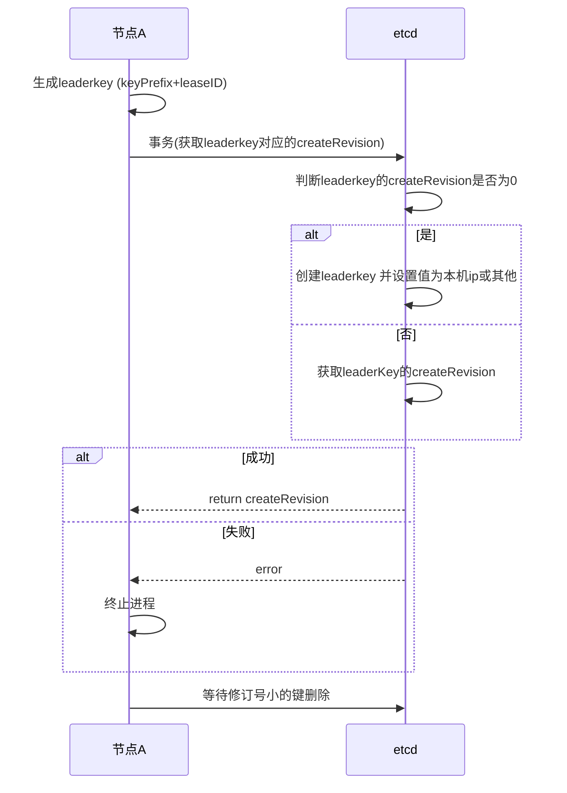

# etcd 选主

## 选举

```mermaid
    sequenceDiagram
    节点A ->> 节点A: 生成leaderkey (keyPrefix+leaseID) 
    节点A ->> etcd: 事务(获取leaderkey对应的createRevision) 
    etcd ->> etcd: 判断leaderkey的createRevision是否为0
    alt 是
    etcd ->> etcd: 创建leaderkey 并设置值为本机ip或其他
    else 否
    etcd ->> etcd: 获取leaderKey的createRevision
    end
    alt 成功
    etcd -->> 节点A: return createRevision
    else 失败
    etcd -->> 节点A: error
    节点A ->> 节点A: 终止进程
    end
    

    节点A ->> etcd: 等待修订号小的键删除 
```