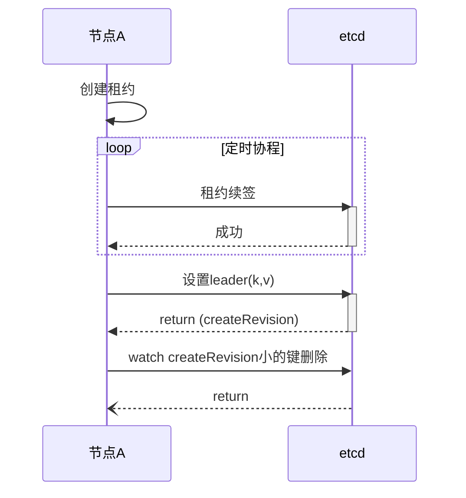

# etcd 选主

## 选举

### 流程说明
1. 节点创建租约
2. 启动协程定时续租
3. 节点调用etcd设置选主所用的key和value，key一般是用户自定义+租约id, value一般是本机ip或其他标志本机的值
4. etcd 返回key对应的创建修订号(createRevision)
5. 节点判断修订号是新创建的还是已存在的，如果是已存在的，节点判断value是否与自己设置的value相同，若不相同则再次设置该值
6. 节点等待其他小于createRevision的节点删除他的键值, 如果是主节点因为前边没有比他小createRevision直接退出， 如果是其他节点，等待小于当前createRevision的key被删除

### 问题
1. #### 节点宕机
    租约保证了在节点宕机时顺利的开始重新选举。 这里的节点宕机主要指选为leader之后的宕机。因为租约其实是一种超时机制， 它关联到session， 它为session创建的key设置了超时时间。 当节点宕机，续约中断， key就会被删除。 这样其他节点就会接到通知，从而当选。 
2. #### etcd 宕机
    raft 机制保证了当etcd leader节点宕机后， 新的leader节点任然会持有选主信息
3. #### 按顺序选
   createRevison 保证了创建key的顺序性， 也就保证了选主的顺序性， etcd的watch机制保证了当领导者宕机时可以快速切换
