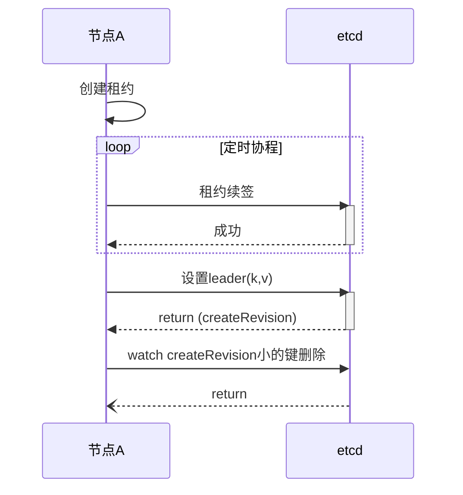

# etcd 选主

## 选举

### 流程说明
1. 节点创建租约
2. 启动协程定时续租
3. 节点调用etcd设置选主所用的key和value，key一般是用户自定义+租约id, value一般是本机ip或其他标志本机的值
4. etcd 返回key对应的创建修订号(createRevision)
5. 节点判断修订号是新创建的还是已存在的，如果是已存在的，节点判断value是否与自己设置的value相同，若不相同则再次设置该值
6. 节点等待其他小于createRevision的节点删除他的键值, 如果是主节点因为前边没有比他小createRevision直接退出， 如果是其他节点，等待小于当前createRevision的key被删除

### 问题
1. #### 节点宕机
    租约保证了在节点宕机时顺利的开始重新选举。 这里的节点宕机主要leader节点宕机。因为租约其实是一种超时机制， 它关联到session， 它为session创建的key设置了超时时间。 当节点宕机，续约中断，session创建的所有key就会被删除。 这样其他节点就会通过etcd的watch机制接到通知，从而当选。 
2. #### etcd 宕机
    raft 机制保证了当etcd leader节点宕机后， 新的leader节点任然会持有选主信息， 并不会不影响节点选主
3. #### 选举顺序
   createRevison 保证了创建key的顺序性， 也就保证了选主的顺序性 
4. #### 分布式锁
    分布式锁的在etcd中的实现同选主逻辑， 只是分布式锁关注的是revision这个值的顺序。 revision也是一个全局递增的数字。 revision相较于createRevision而言不仅关注建的创建还包括更新和删除。 只要状态变化revision的值就会增加
5. #### 为什么分布式锁不用createRevision?
    每个键在创建时都会分配一个createRevison值， 这个值不会再变化，相当于键创建的那一刻就已注定。由于这个特性， 分布式锁如果使用createRevision会存在问题。 

    看如下示例

    假设我们有两个节点 A，B
    节点A 创建了一个键，尝试获取锁， 此时这个键的createRevision为10
    然后节点B 也创建了一个键，尝试获取锁， B创建的键的createRevision为11
    节点A 删除键，释放了锁，但此时，键对应的createRevision并未改变依然是10
    节点B 看到节点A释放了锁， 顺理成章获取了锁
    此时节点A再次来获取锁，因为A的键没变所以createRevision仍然为10，这个值是小于B的createRevison的。 这种情况它就会认为锁已释放，它获取到了锁。 这样最终结果就是两个节点都认为自己获取到了锁。
6. #### 为什么选主逻辑不用revision
    如果在领导者选举中使用 Revision 而不是 CreateRevision，可能会出现一些问题。这是因为 Revision 是全局的，每当 etcd 集群的状态发生变化（例如，添加、修改或删除了一个键值对）时，Revision 就会递增。这意味着，Revision 的值并不只反映一个特定键的状态，而是反映了整个 etcd 集群的状态。

    让我们通过一个例子来说明这个问题：

    假设我们有三个节点：A、B 和 C。他们都试图成为领导者。

    节点 A 创建了一个键，尝试成为领导者。这个键的 Revision 是 10。
    然后，节点 B 也创建了一个键，尝试成为领导者。这个键的 Revision 是 11。
    此时，节点 C 更新了一个与选举无关的键。这导致 Revision 递增到 12。
    然后，节点 A 检查它的键的 Revision。它看到的 Revision 是 10，而当前的 Revision 是 12，所以它认为有其他节点已经成为了领导者，于是它放弃了选举。
    但实际上，节点 B 的键的 Revision 也只是 11，并没有达到 12。这意味着，没有节点达到当前的 Revision，所以没有节点成为领导者。
    在这个例子中，由于 Revision 反映的是整个 etcd 集群的状态，而不只是一个特定键的状态，所以它可能会导致误判。这就是为什么在领导者选举中，我们通常使用 CreateRevision 而不是 Revision。CreateRevision 只反映一个特定键的创建版本，所以它可以更准确地反映选举的状态。
   
### 适用场景
大量节点进行选主

