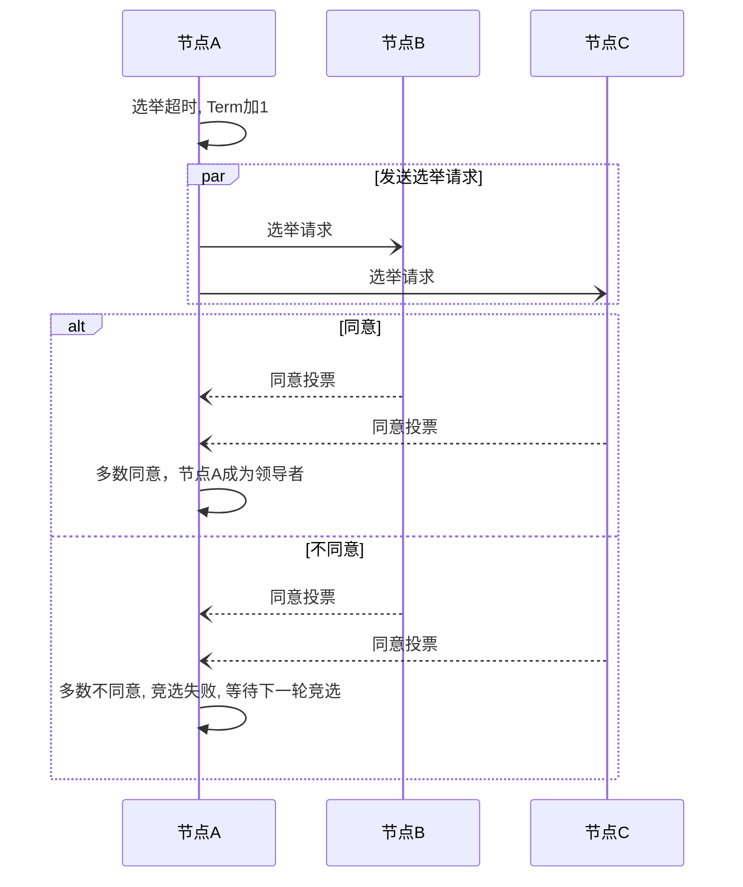
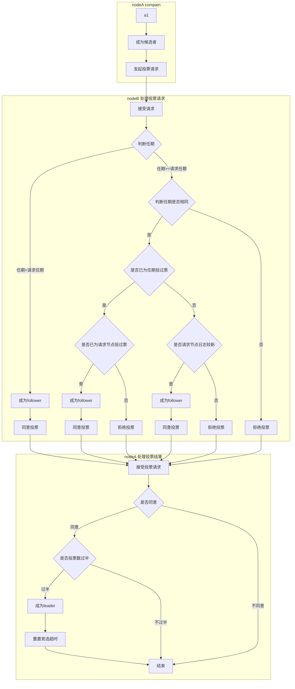

#
## raft 选举

```mermaid
   sequenceDiagram
   节点A ->>  节点A: 选举超时, Term加1
   par 发送选举请求
    节点A -) 节点B: 选举请求 
    节点A -) 节点C: 选举请求
   end
   alt 同意
    节点B --) 节点A: 同意投票
    节点C --) 节点A: 同意投票
    节点A ->> 节点A: 多数同意，节点A成为领导者 
   else  不同意
    节点B --)  节点A: 同意投票
    节点C --)  节点A: 同意投票
    节点A ->> 节点A: 多数不同意, 竞选失败, 等待下一轮竞选
   end
```

### 投票逻辑

```mermaid
flowchart 
    subgraph "nodeA compain"
        direction TB
        a1 --> a2[成为候选者]
        a2 --> a3[发起投票请求]
    end
    subgraph "nodeA 处理投票结果"
        direction TB
        a5[接受投票请求] --> a6{是否同意}
        a6 --"同意"-->a7{是否投票数过半}
        a6 --"不同意"--> a8[结束]
        a7 --"过半"-->a9[成为leader]
        a7 --"不过半"-->a8[结束]
        a9 --> a10[重置竞选超时]
        a10 --> a8
    end
    subgraph "nodeB 处理投票请求"
        direction TB
        b1[接受请求] --> b2{判断任期} 
        b2 -- "任期<请求任期" --> b3[成为follower]
        b2 --"任期>=请求任期"--> b4{判断任期是否相同}
        b4 --"是"--> b5{是否已为任期投过票}
        b5 --"是"--> b6{是否已为请求节点投过票} 
        b6 --"是"--> b7[成为follower]
        b5 --"否"--> b8{是否请求节点日志较新}
        b8 --"是"--> b9[成为follower]
        b8 --"否"-->b10[拒绝投票]
        b6 --"否"-->b11[拒绝投票]
        b4 --"否"-->b12[拒绝投票]
        b3 --> b13[同意投票]
        b7-->b14[同意投票]
        b9-->b15[同意投票]
    end
    a3 --> b1
    b14-->a5
    b15-->a5
    b13-->a5
    b10-->a5
    b11-->a5
    b12-->a5

```

# 适用场景
少量节点进行选主