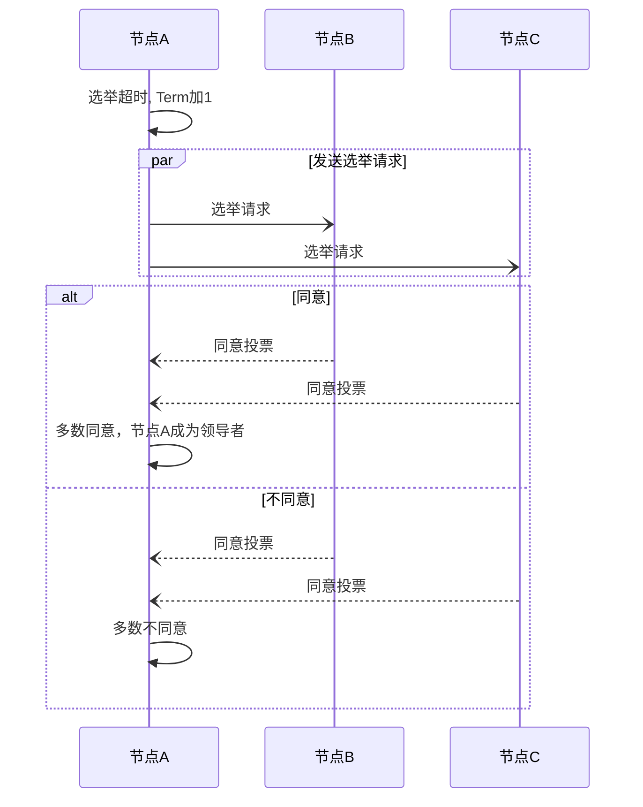
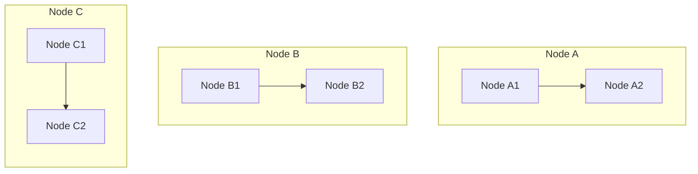

#
## raft 选举

```mermaid
   sequenceDiagram
   节点A ->>  节点A: 选举超时, Term加1
   par 发送选举请求
    节点A -) 节点B: 选举请求 
    节点A -) 节点C: 选举请求
   end
   alt 同意
    节点B --) 节点A: 同意投票
    节点C --) 节点A: 同意投票
    节点A ->> 节点A: 多数同意，节点A成为领导者 
   else  不同意
    节点B --)  节点A: 同意投票
    节点C --)  节点A: 同意投票
    节点A ->> 节点A: 多数不同意 
   end
```

### 投票逻辑

```mermaid
flowchart 
    subgraph "Node A"
        A1[Node A1]
        A2[Node A2]
        A1 --> A2
    end

    subgraph "Node B"
        B1[Node B1]
        B2[Node B2]
        B1 --> B2  
    end

    subgraph "Node C"
        direction TB
        C1[Node C1]
        C2[Node C2]
        C1 --> C2
    end


```