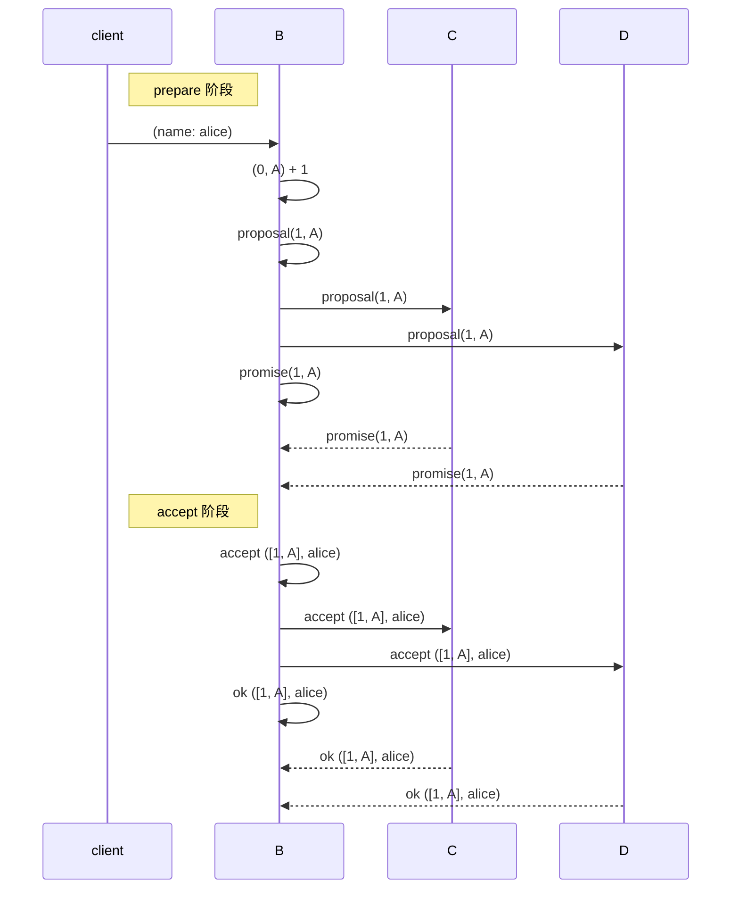
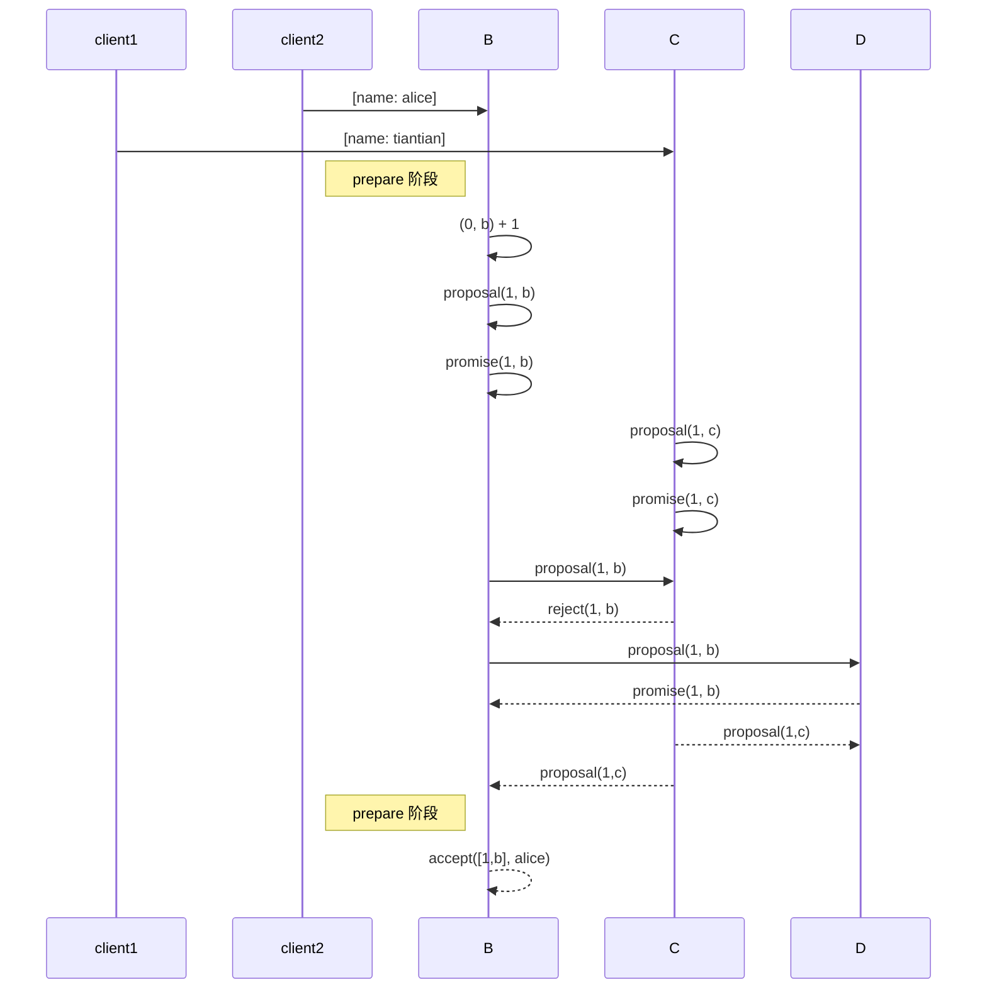

# paxos

## 3. basic-paxos
### 场景1 正常情况

说明
1. prepare阶段
   1. A 提案号+1，发送proposal请求到所有节点
   2. B，C 收到proposal后对比请求的提案号和当前已经promise过的提案号， 如果比自身的提案号大，修改当前提案号为请求提案号，并返回promise，如果已经accept过proposal还有返回accept过的proposal。否则拒绝。  
   3. A 收到大多数promise后， 先判断是否有任何节点返回了accept的proposal，如果有且proposal提案号大，则更新自己的提案值为提案号大的值。 之后进入accept阶段 
2. accept阶段
   1. A 发送accept请求到所有节点
   2. B，C 收到accept请求后，同样对比提案号， 号大的则更新本地提案为接收到的提案并返回成功的响应。 否则拒绝 
   3. A 收到大多数响应后记录值， 并向所有节点发送commit请求

### 场景2 B 拒绝proposal

## 2. paxos 的使用场景

